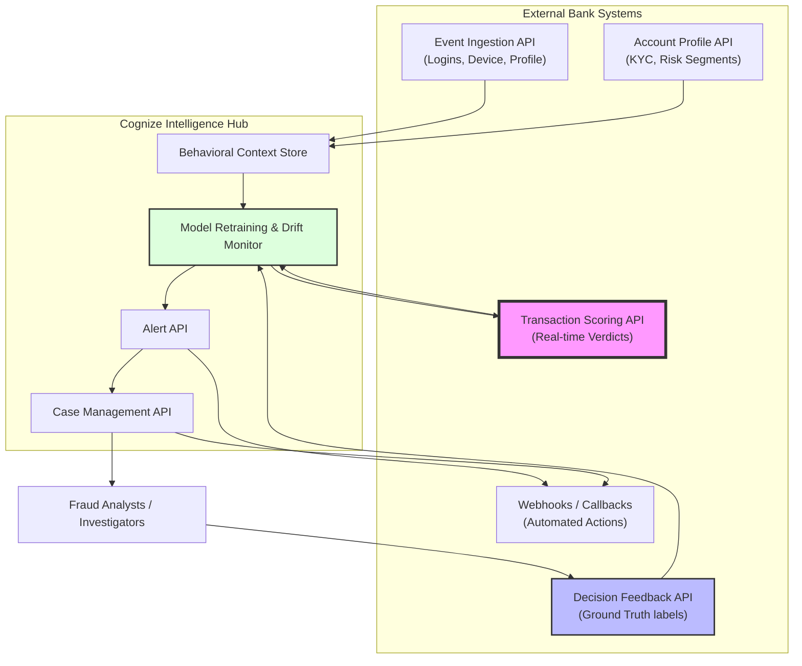

# Enterprise Fraud Detection Architecture

The following diagram illustrates the bank-grade API ecosystem implemented in the Cognize Fraud Detection Platform.

## The 7-API Cycle

1.  **Event Ingestion**: Platforms receive non-financial signals (logins, beneficiary adds) to build context.
2.  **Account Profile**: Syncs KYC and historical risk segments from the bank's core.
3.  **Transaction Scoring**: The critical real-time lookup for transaction authorization.
4.  **Alert API**: Programmatic access to detected threats for downstream SIEM/SOAR systems.
5.  **Case Management**: Investigator workflow for deep-dive forensics and SAR filing.
6.  **Decision Feedback**: The most vital link for "Closed Loop" ML—learning from real-world outcomes.
7.  **Webhooks**: Enables the bank to act immediately on critical alerts without polling.
